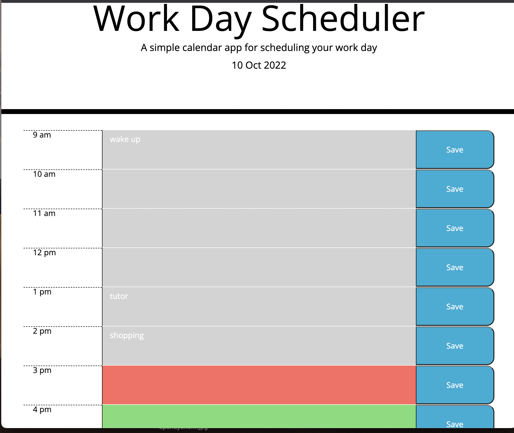

# Daily-calendar

Daily planner 

## Goal

Create a daily pplanner to manage time of the day and tasks effectively

## Acceptance Criteria

When the planner is open, the current date/day is displayed on top.
Time blocks for each standard business hour is displayed below. 
Each hour is color coded according to past, present and future. Each block has a space to enter the task and a save button.
When Save button is clicked - the tasks are saved in local storage and presented when I re-open the planner

## Mock-up

image of the working page

   
   
<<<<<<< HEAD
=======
   
   
  
  
>>>>>>> 5f9434240aa38ca76ee1eeeb7049986ad1d4c614

## Credits

class instructor
Sean New

## License

MIT license

